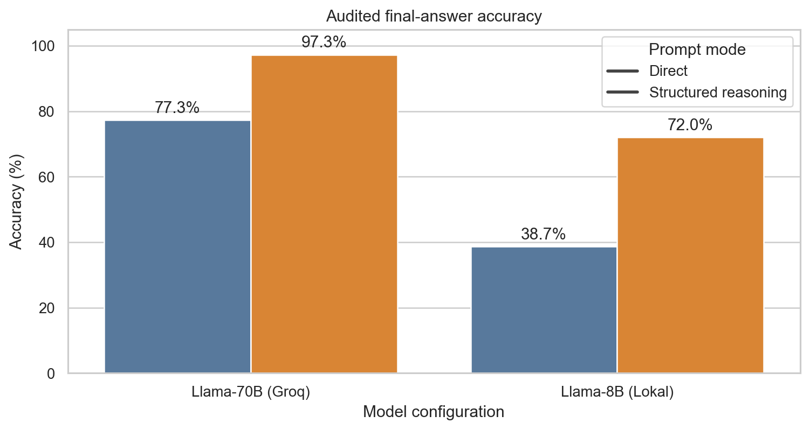
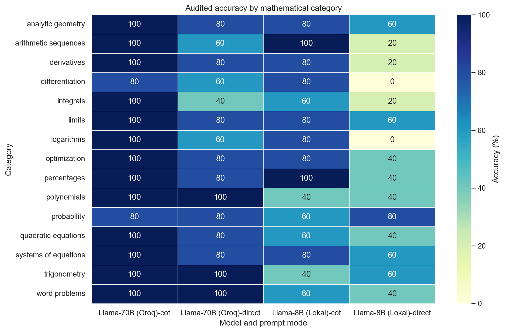

# LLM-Tutor: Structured Reasoning for Mathematical Problem Solving

LLM-Tutor is a small, reproducible evaluation project for an AI mathematics tutor. LLM-Tutor evaluates whether a structured response prompt improves the correctness and usability of LLM-generated solutions to elementary and intermediate mathematics problems. It compares a result-only prompt with a structured-reasoning prompt across local and hosted Llama models, then measures answer accuracy, output-format compliance, and latency.

## Headline results

The benchmark contains 75 questions across 15 categories, with five questions per category. Each configuration was evaluated on the same questions.

| Model | Prompt mode | Accuracy | Accuracy lift | Mean latency | Format compliance |
| --- | --- | ---: | ---: | ---: | ---: |
| Llama 3.3 70B via Groq | Direct | 77.3% | - | 0.25 s | 100.0% |
| Llama 3.3 70B via Groq | Structured reasoning | 97.3% | +20.0 p.p. | 0.83 s | 100.0% |
| Llama 3 8B via Ollama | Direct | 38.7% | - | 2.83 s | 98.7% |
| Llama 3 8B via Ollama | Structured reasoning | 72.0% | +33.3 p.p. | 35.69 s | 100.0% |


The raw CSV preserves the recorded `score` column and an independently audited `audited_score` column.




## What the project demonstrates

- A balanced, category-stratified benchmark for mathematical questions
- A deterministic evaluator with exact-text, alternative-answer, multi-part, symbolic, and approximate numeric checks
- A clean separation between model response generation and offline result analysis
- Comparison of quality, latency, and output-contract compliance
- An offline analysis notebook with reproducible summary tables and figures

## Repository layout

```text
.
├── data/
│   ├── math_tasks.json
│   ├── tutor_benchmark_raw_results.csv
│   └── tutor_benchmark_summary.csv
├── notebooks/
│   └── 01_llm_tutor_evaluation.ipynb
├── reports/
│   └── technical_report.md
├── scripts/
│   ├── build_notebook.py
│   └── make_assets.py
├── src/llm_tutor/
│   └── evaluation.py
├── tests/
│   └── test_evaluation.py
├── .gitignore
├── requirements.txt
└── README.md
```

## Reproduce the offline analysis

```bash
python -m venv .venv
source .venv/bin/activate  # Windows: .venv\Scripts\activate
pip install -r requirements.txt

PYTHONPATH=src pytest -q
jupyter nbconvert --to notebook --execute notebooks/01_llm_tutor_evaluation.ipynb \
  --output 01_llm_tutor_evaluation.executed.ipynb \
  --ExecutePreprocessor.timeout=120
```

The offline notebook reads the committed benchmark outputs and does not call an external model API.

## Evaluation caveats

- Five tasks per category is useful for a compact project, but too small for stable estimates by category.
- The benchmark uses a hand-authored answer key and a deterministic parser; evaluator errors can affect measured accuracy.
- Latency is not comparable across local CPU/GPU hardware and Groq infrastructure without a controlled environment.
- Prompt mode changes both the requested response format and the amount of generated text, so the comparison is not a pure test of explanation alone.
- “Structured reasoning” describes the prompt and output format. It does not prove that the visible reasoning is faithful to the model's internal process.
- The models, provider APIs, and rate limits may change over time.
